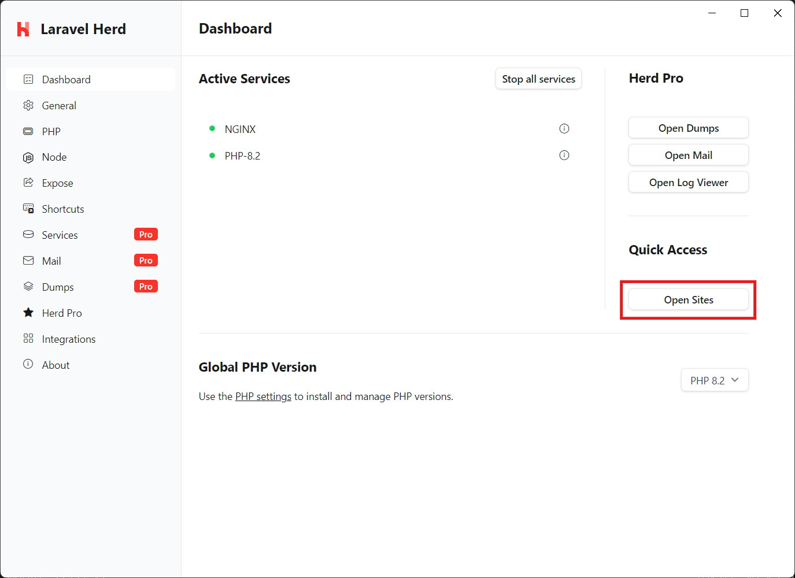
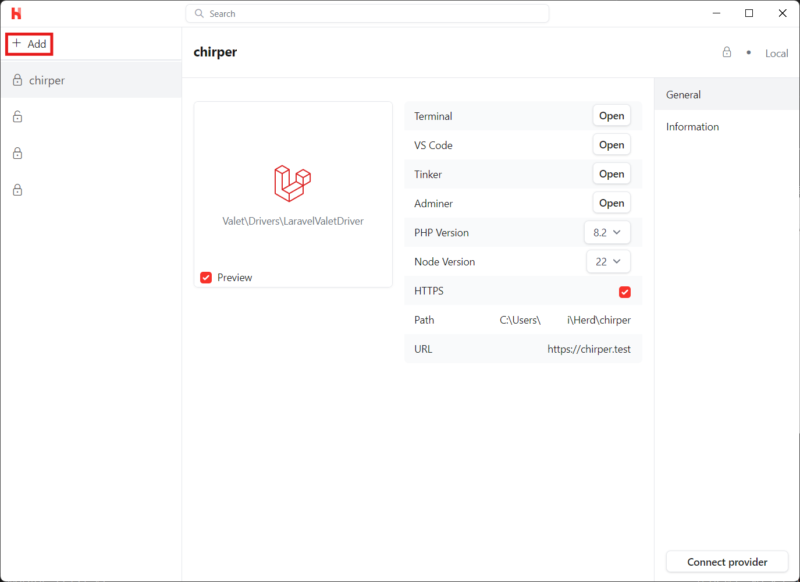
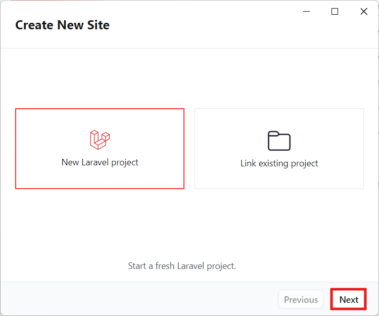
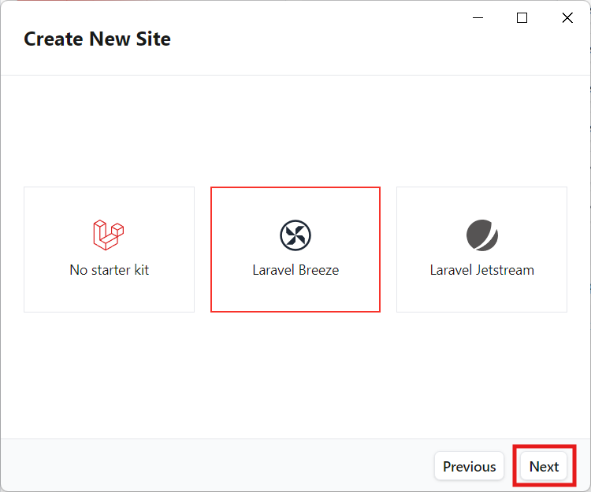
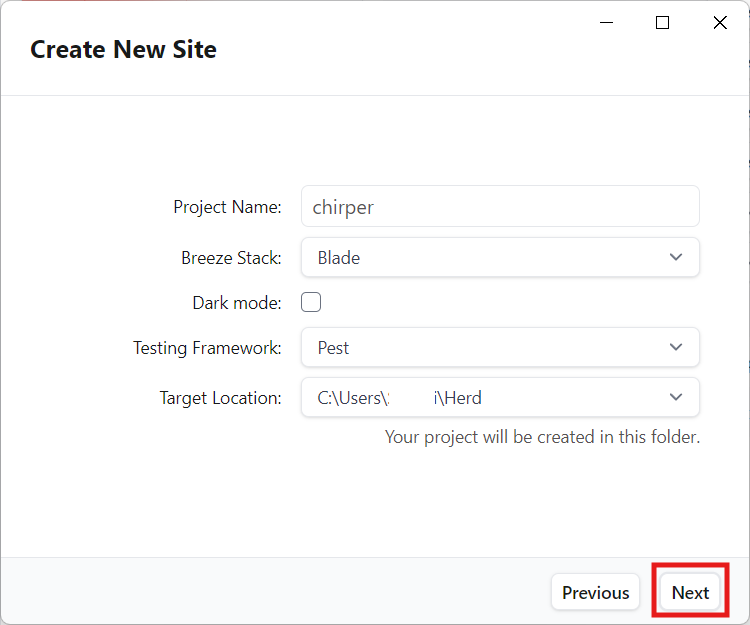
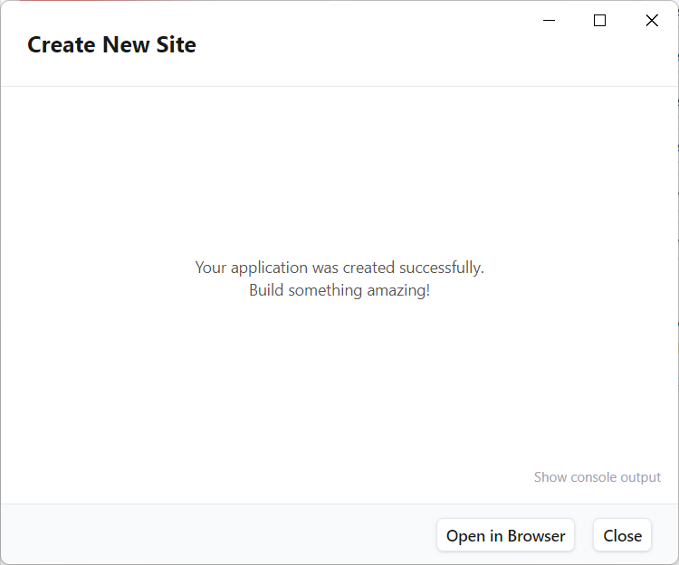

# インストール

<https://bootcamp.laravel.com/blade/installation>

Laravel Herd（以下、単にHerdとも）のGUIを利用してインストールを行います。
インストーラーをダウンロード、実行した前提で進めます。

1. Herdのダッシュボードかシステムトレイから、サイトメニューを開きます。

1. 「+ Add」をクリックします。

1. 「Create New Site」を選んで、「Next」をクリックします。

1. このプロジェクトでは、Laravel Breezeをインストールするので、そちらを選択します。
あるいは「No starter kit」をして、後でコマンドからインストールすることもできます。

1. プロジェクト名などの設定を行って、「Next」をクリックするとインストールが始まります。

1. しばらく待つとインストールが完了し、ブラウザで開くことができます。
また、Breezeをインストールするとすでに認証機能は動作しています。

