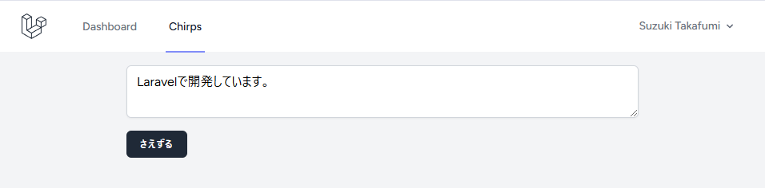

# 基本的な機能の作成

<https://bootcamp.laravel.com/blade/creating-chirps>

ウェブアプリケーションの基本機能であるデータベースの CRUD 機能を作成します。CRUD は以下の機能を示します。

1. Create: 作成
1. Read: 読み込み
1. Update: 更新
1. Delete: 削除

ウェブアプリケーションであるため、これらの機能をアプリ上で実現することが目的になります。

## モデル、マイグレーション、コントローラー

ウェブアプリケーションの機能のために、モデル、マイグレーション、コントローラーが必要です。それぞれ以下のような役割があります。

- モデル：データベースの操作を行う
- マイグレーション：データベースのテーブル構造を定義する
- コントローラー：ユーザーからのリクエストを受け、モデルに指示を出しレスポンスを返す

一つのデータベーステーブルに関して、これら 3 つがそれぞれ対応しているため、一つのコマンドで作成することができます。
次のコマンドは、Chirp という投稿のために作成する例です。

```bash
php artisan make:model -mr Chirp
```

`-mr`オプションはそれぞれマイグレーションと（リソース）コントローラーを作成します。

リソースコントローラーは CRUD 処理のメソッドがあらかじめテンプレートとして作成されているコントローラーです。
コマンドによって、３つのファイルが作成されます。

- `app/Models/Chirp.php`
- `database/migrations/<timestamp>_create_chirps_table.php`
- `app/Http/Controllers/ChirpController.php`

## ルーティング

コントローラーがリクエストを受け取るには、URL（ルート）が必要です。
ウェブからのルートは、`routes/web.php`で定義されるので、そちらに`ChirpController`へのルートを追加します。

```php
<?php

use App\Http\Controllers\ChirpController;

Route::resource('chirps', ChirpContoller::class)
    ->only(['index', 'store'])
    ->middleware(['auth', 'verified']);
```

上のコードでは、`/chirps`のルートへのリクエストを ChirpController が処理するよう設定するものです。
その中でも`only()`メソッドで、`index`と`store`のルートのみを有効にしています。

また`middleware()`メソッドは、[ミドルウェア](https://laravel.com/docs/11.x/middleware)と呼ばれるリクエストの実行前の処理を定義しています。
`auth`は認証状態であるか、`verified`はメールが検証済みかを確認し、両方に当てはまらなければリクエストは実行されません。

現在、`/chirps`にアクセスしても何も表示されません。
`ChirpController`の`index`メソッドを更新します。

```php
<?php

use Illuminate\Http\Response;

class ChirpController extends Controller
{
    /**
     * Display a listing of the resource.
     */
    public function index(): Response
    {
        return response('Hello, World!');
    }
}
```

変更を保存して`/chirps`にアクセスすると、設定したレスポンスが表示されます。

## Blade

ウェブアプリでは、単純なレスポンス以外にページを返す必要もあります。

`ChirpController`のメソッドを変更して、Blade のビュー（ページ）を表示します。

```php
use Illuminate\View\View;

class ChirpController extends Controller
{
    /**
     * Display a listing of the resource.
     */
    public function index(): View
    {
        return view('chirps.index');
    }
}
```

表示されるビューを`resources/views/chirps/index.blade.php`として作成します。
直接ファイルを作成してもいいですし、次のコマンドで作成することもできます。

```bash
php artisan make:view chirps.index
```

```html
<x-app-layout>
    <div class="max-w-2xl mx-auto p-4 sm:p-6 lg:p-8">
        <form method="post" action="{{ route('chirps.store') }}">
            @csrf
            <textarea
                name="message"
                placeholder="{{ __('今の気分は？') }}"
                class="block w-full border-gray-300 focus:border-indigo-300 focus:ring focus:ring-indigo-200 focus:ring-opacity-50 rounded-md shadow-sm"
            >
{{ old('message') }}</textarea
            >
            <x-input-error :messages="$errors->get('message')" class="mt-2" />
            <x-primary-button class="mt-4"
                >{{ __('さえずる') }}</x-primary-button
            >
        </form>
    </div>
</x-app-layout>
```

ページを更新すると、フォームが表示されます。

## ナビゲーションメニュー

ナビゲーションメニュー`rosources/views/layouts/navigation.blade.php`を更新して、Chirp へのリンクを作成します。

```html
<!-- Navigation Links -->
<div class="hidden space-x-8 sm:-my-px sm:ms-10 sm:flex">
    <x-nav-link
        :href="route('dashboard')"
        :active="request()->routeIs('dashboard')"
    >
        {{ __('Dashboard') }}
    </x-nav-link>
    <x-nav-link
        :href="route('chirps.index')"
        :active="request()->routeIs('chirps.index')"
    >
        {{ __('Chirps') }}
    </x-nav-link>
</div>
```

レスポンシブ部分も同様に修正します。

```html
<div class="pt-2 pb-3 space-y-1">
    <x-responsive-nav-link
        :href="route('dashboard')"
        :active="request()->routeIs('dashboard')"
    >
        {{ __('Dashboard') }}
    </x-responsive-nav-link>
    <x-responsive-nav-link
        :href="route('chirps.index')"
        :active="request()->routeIs('chirps.index')"
    >
        {{ __('Chirps') }}
    </x-responsive-nav-link>
</div>
```

## 投稿を保存する

作成したフォームのリクエスト先である`ChirpController`の`store`メソッドを更新し、データの検証（バリデーション）と保存を行います。

```php
<?php

use Illuminate\Http\RedirectResponse;

class ChirpController extends Controller
{
    public function store(Request $request): RidirectResponse
    {
        $validated = $request->validate([
            'message' => 'required|string|max:255',
        ]);

        $request->user()->chirps->create($validated);

        return redirect(route('chirps.index'));
    }
}
```

## リレーションを定義する

投稿データには、投稿者を含みます。このような関係（リレーション）を`User`モデルに定義します。

```php
<?php

use Illuminate\Database\Eloquent\Relations\HasMany;

class User extends Authenticatable
{
    public function chirps(): HasMany
    {
        return $this->hasMany(Chirps::class);
    }
}
```

## 一括代入からの保護

一括代入は、リクエストの複数のデータを持つオブジェクトを一括してコピーする機能です。
ウェブアプリケーションフレームワークで活用されています。

便利である一方で、予期しないリクエスト（例：`is_admin`などと改ざんし管理者を装う）。

Laravel では、デフォルトで一括代入をブロックしています。
モデルの`$fillable`で指定したプロパティのみ一括代入可能になります。

```php
<?php

class Chirp extends Model
{
    protected $fillable = [
        'message',
    ];
}
```

## マイグレーションの更新

Laravelでは、`php artisan db:show`と`php artisan db:table`コマンドで現在のデータベース構造を調べることができます。

`Chirp`テーブルには、ユーザーとメッセージを保存するカラムが必要ですので、モデルと同時に作成されたマイグレーションファイルを編集します。

```php
<?php

return new class extends Migration
{
    /**
     * Run the migrations.
     */
    public function up(): void
    {
        Schema::create('chirps', function (Blueprint $table) {
            $table->id();
            $table->foreignId('user_id')->constrained()->cascadeOnDelete();
            $table->string('message');
        });
    }
}
```

**マイグレーションファイルを編集してから**マイグレーションを実行します。

```bash
php artisan migrate
```

## テストする

データベースを設定し、Chirpが保存できるようになりました。
まだ表示する機能はありません。



メッセージフィールドが空か、255文字を超えるとバリデーションルールにしたがって、エラーが表示されます。

### Artisan Tinker

Laravelで任意のコードを実行できるREPL(Read-eval-print loop)である、Artisan Tinkerで保存されたデータを確認します。

コンソールで新しいTinkerセッションを開始します。

```bash
php artisan tinker
```

次のコードを実行すると、Chirpテーブルの全内容が表示されます。

```php
App\Models\Chirp::all();
```

Tinkerを終了するには`exit`コマンドを入力するか`Ctrl+c`を押します。
