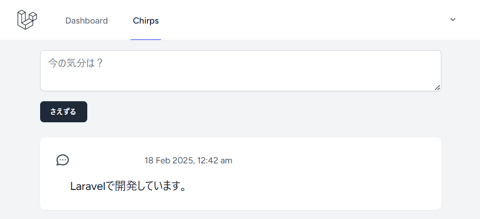

# 投稿の表示

<https://bootcamp.laravel.com/blade/showing-chirp>

投稿を保存する機能を作成したので、表示する機能を作成します。

## 投稿の取得

`ChirpsController`の`index`メソッドを更新して、投稿データを取得します。

```php
class ChirpsController extends Controller
{
    /**
     * Display a listing of the resource
     */
    public function index(): view
    {
        return view('chirps.index', [
            'chirps' => Chirp::with('user')->latest->get();
        ]);
    }
}
```

## Chirpモデルのリレーション定義

`User`モデルから`Chirp`モデルへのリレーションを定義しましたが、逆も必要です。

```php
<?php

use Illuminate\Database\Eloquent\Relations\BlongsTo;

class Chirp extends Model
{
    public function user(): BelongsTo
    {
        return $this->belongsTo(User::class);
    }
}
```

## ビューの更新

`chirps.index`を更新して、フォームの下に投稿を表示できるようにします。

```php
<div class="mt-6 bg-white shadow-sm rounded-lg divide-y">
    @foreach ($chirps as $chirp)
        <div class="p-6 flex space-x-2">
            <svg xmlns="http://www.w3.org/2000/svg" class="h-6 w-6 text-gray-600 -scale-x-100" fill="none" viewBox="0 0 24 24" stroke="currentColor" stroke-width="2">
                <path stroke-linecap="round" stroke-linejoin="round" d="M8 12h.01M12 12h.01M16 12h.01M21 12c0 4.418-4.03 8-9 8a9.863 9.863 0 01-4.255-.949L3 20l1.395-3.72C3.512 15.042 3 13.574 3 12c0-4.418 4.03-8 9-8s9 3.582 9 8z" />
            </svg>
            <div class="flex-1">
                <div class="flex justify-between items-center">
                    <div>
                        <span class="text-gray-800">{{ $chirp->user->name }}</span>
                        <small class="ml-2 text-sm text-gray-600">{{ $chirp->created_at->format('j M Y, g:i a') }}</small>
                    </div>
                </div>
                <p class="mt-4 text-lg text-gray-900">{{ $chirp->message }}</p>
            </div>
        </div>
    @endforeach
</div>
```

ブラウザを更新すると、投稿が表示されます。


